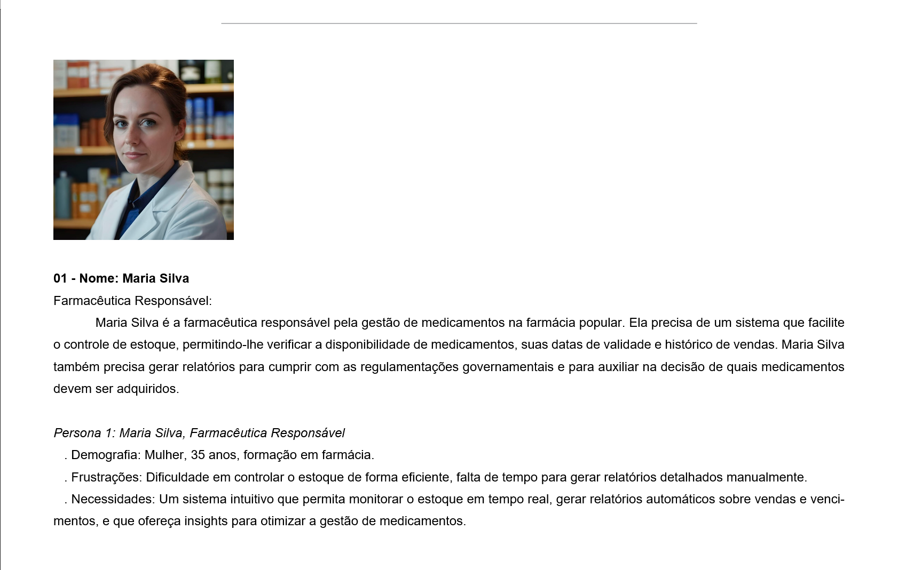
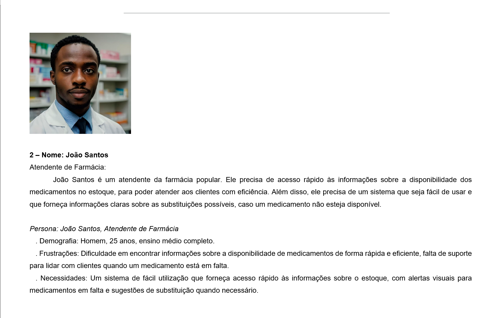
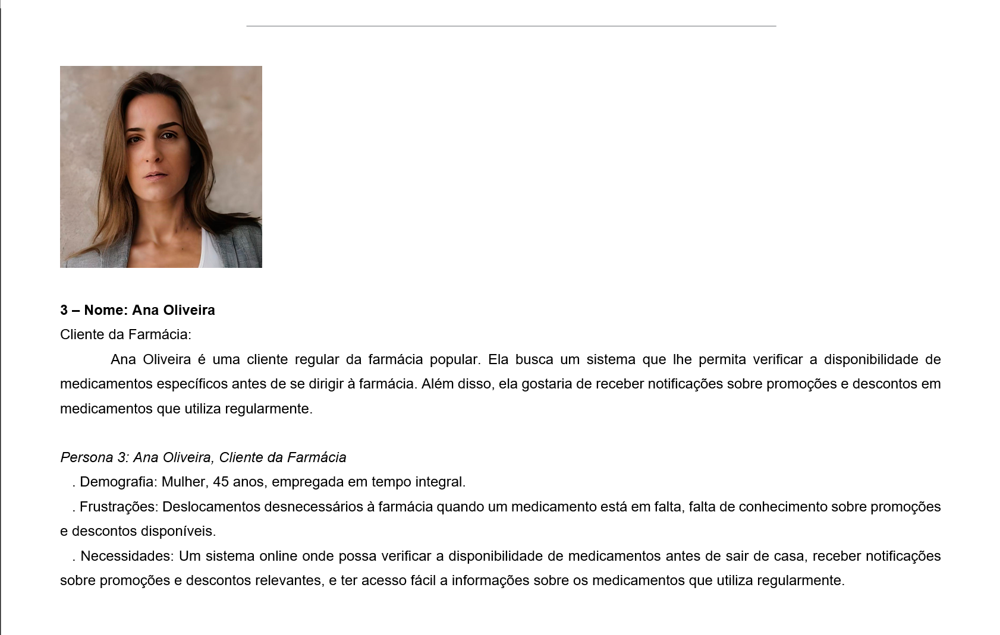
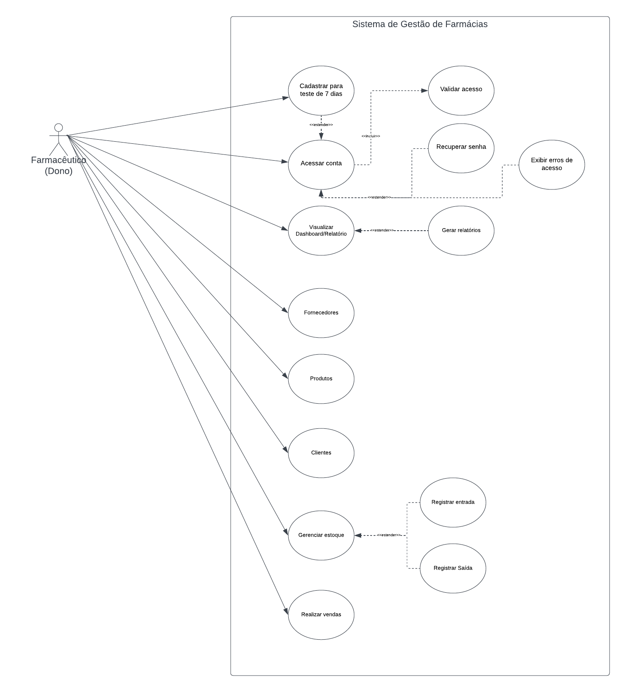

# Especificações do Projeto

Pré-requisitos: <a href="1-Documentação de Contexto.md"> Documentação de Contexto</a>

Nesta seção do documento, abordaremos a criação de um Sistema de Estoque para Farmácias, com um foco primordial na perspectiva do usuário. Utilizaremos diversas técnicas e ferramentas para especificar o projeto de forma abrangente e precisa.

### Definição do Problema:

O desafio principal é desenvolver um sistema que permita às farmácias gerenciar eficientemente seus medicamentos e produtos. Isso implica facilitar o controle de estoque, reduzir perdas devido ao vencimento de produtos e aprimorar a gestão financeira.

### Ideia de Solução:

A solução proposta visa a criação de um sistema de estoque robusto e intuitivo, capaz de atender às necessidades das farmácias de maneira abrangente. Isso inclui a implementação de funcionalidades que facilitem o controle de medicamentos vencidos, identificação da demanda de produtos e melhoria nos processos operacionais.

### Técnicas e Ferramentas Utilizadas:

#### 1 - Definição de Personas:

Serão elaborados três perfis de usuários representativos, permitindo uma compreensão mais profunda das necessidades e expectativas dos clientes.

#### 2 - Histórias de Usuários:

Serão criadas histórias que descrevem cenários específicos de uso do sistema, fornecendo insights sobre as funcionalidades necessárias.

#### 3 - Requisitos Funcionais e Não Funcionais:

Serão identificados os requisitos relacionados às funções do sistema, bem como os requisitos de desempenho, segurança e usabilidade.

#### 4 - Restrições do Projeto:

Serão consideradas limitações como orçamento, prazos e recursos disponíveis, garantindo a viabilidade do projeto dentro de determinados parâmetros.

Ao utilizar essas técnicas e ferramentas, buscamos garantir que o Sistema de Estoque para Farmácias seja desenvolvido de maneira eficaz, atendendo às necessidades dos usuários e superando os desafios enfrentados pelas farmácias na gestão de estoque.

## Personas

## Histórias de Usuários

Com base na análise das personas foram identificadas as seguintes histórias de usuários:

| EU COMO... `PERSONA` | QUERO/PRECISO ... `FUNCIONALIDADE`                                                                                                                         | PARA ... `MOTIVO/VALOR`                                                                                                                                                       |
| -------------------- | ---------------------------------------------------------------------------------------------------------------------------------------------------------- | ----------------------------------------------------------------------------------------------------------------------------------------------------------------------------- |
| Maria Silva          | Registrar a entrada e saída de produtos no sistema de estoque, realizando atualizações e visualizando de forma clara os produtos, fornecedores e clientes. | Manter um controle atualizado dos medicamentos e produtos disponíveis.                                                                                                        |
| João Santos          | Receber notificações automáticas quando os níveis de estoque de determinados produtos estiverem baixos e verificar o estoque atual.                        | Poder fazer pedidos de reposição de forma eficiente para evitar falta ou excesso de estoque.                                                                                  |
| Ana Oliveira         | Acessar relatórios detalhados sobre o desempenho do estoque da farmácia.                                                                                   | Acessar uma litsa completa dos produtos para verificar informações sobre os medicamentos utilizados regularmente, economizando tempo e evitando deslocamentos desnecessários. |

## Requisitos

As tabelas que se seguem apresentam os requisitos funcionais e não funcionais que detalham o escopo do projeto. Para determinar a prioridade de requisitos, aplicar uma técnica de priorização de requisitos e detalhar como a técnica foi aplicada.

### Requisitos Funcionais

| ID     | Descrição do Requisito                                 | Historia do Usuário                                                                                                                                                      | Prioridade |
| ------ | ------------------------------------------------------ | ------------------------------------------------------------------------------------------------------------------------------------------------------------------------ | ---------- |
| RF-001 | Listar Produtos, Fornecedores, Clientes e Funcionários | Como usuário, quero visualizar uma lista completa de produtos, fornecedores, clientes e funcionários para facilitar a consulta.                                          | ALTA       |
| RF-002 | Adicionar Produto, Fornecedor, Cliente ou Funcionário  | Como usuário, desejo poder adicionar novos produtos, fornecedores, clientes ou funcionários ao sistema para manter as informações atualizadas.                           | ALTA       |
| RF-003 | Editar Produto, Fornecedor, Cliente ou Funcionário     | Como usuário, desejo editar as informações de produtos, fornecedores, clientes ou funcionários para corrigir dados ou realizar atualizações.                             | ALTA       |
| RF-004 | Verificar e Atualizar Estoque                          | Como usuário, quero verificar o estoque atual e ter a capacidade de atualizar as quantidades disponíveis para garantir precisão nas informações.                         | ALTA       |
| RF-005 | Registrar Nova Venda                                   | Como usuário, desejo registrar novas vendas no sistema, incluindo detalhes como produtos vendidos, quantidades e datas, para manter um histórico preciso.                | ALTA       |
| RF-006 | Relatório de Vendas e Estoque                          | Como usuário, desejo gerar relatórios detalhados de vendas e estoque para análise e tomada de decisões informadas.                                                       | MÉDIA      |
| RF-007 | Relatório de Clientes e Funcionários                   | Como usuário, desejo obter relatórios que forneçam informações sobre clientes e funcionários para facilitar a gestão e avaliação do desempenho.                          | MÉDIA      |
| RF-008 | Alterar Senha e Configurações de perfil                | Como usuário, desejo ter a capacidade de alterar minha senha e ajustar configurações de perfil conforme necessário para garantir a segurança e personalização do acesso. | BAIXA      |

### Requisitos não Funcionais

| ID      | Descrição do Requisito                                                                                                             | Prioridade |
| ------- | ---------------------------------------------------------------------------------------------------------------------------------- | ---------- |
| RNF-001 | A interface do usuário deve ser intuitiva e fácil de usar para garantir eficiência no gerenciamento.                               | ALTA       |
| RNF-002 | O acesso às informações do sistema deve ser protegido por autenticação, e a senha deve ser armazenada de forma segura.             | ALTA       |
| RNF-003 | O sistema deve ser capaz de lidar com um aumento futuro no número de produtos, clientes e transações sem comprometer o desempenho. | MÉDIA      |
| RNF-004 | Atualizações e manutenções do sistema devem ser realizadas de forma fácil e sem interromper as operações principais.               | BAIXA      |
| RNF-005 | O sistema deve ser capaz de processar operações de gerenciamento rapidamente, mesmo com grandes conjuntos de dados.                | BAIXA      |

Com base nas Histórias de Usuário, enumere os requisitos da sua solução. Classifique esses requisitos em dois grupos:

- [Requisitos Funcionais
  (RF)](https://pt.wikipedia.org/wiki/Requisito_funcional):
  correspondem a uma funcionalidade que deve estar presente na
  plataforma (ex: cadastro de usuário).
- [Requisitos Não Funcionais
  (RNF)](https://pt.wikipedia.org/wiki/Requisito_n%C3%A3o_funcional):
  correspondem a uma característica técnica, seja de usabilidade,
  desempenho, confiabilidade, segurança ou outro (ex: suporte a
  dispositivos iOS e Android).
  Lembre-se que cada requisito deve corresponder à uma e somente uma
  característica alvo da sua solução. Além disso, certifique-se de que
  todos os aspectos capturados nas Histórias de Usuário foram cobertos.

## Restrições

O projeto está restrito pelos itens apresentados na tabela a seguir.

| ID  | Restrição                                                                           |
| --- | ----------------------------------------------------------------------------------- |
| 01  | Orçamento limitado para desenvolvimento.                                            |
| 02  | Prazo de implementação definido para 6 meses.                                       |
| 03  | Necessidade de compatibilidade com diferentes dispositivos e sistemas operacionais. |

## Diagrama de Casos de Uso

