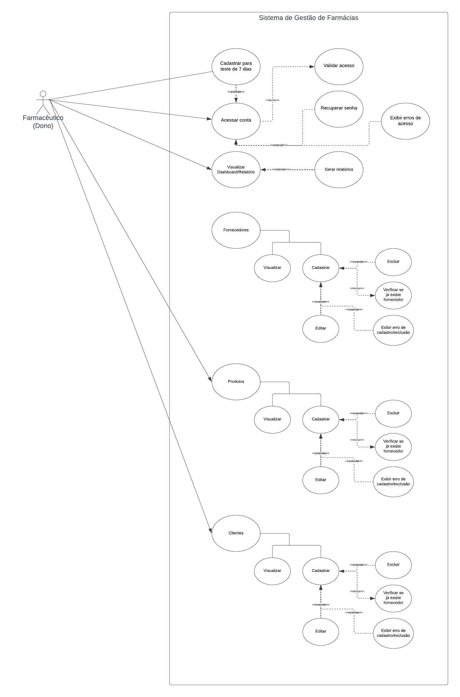
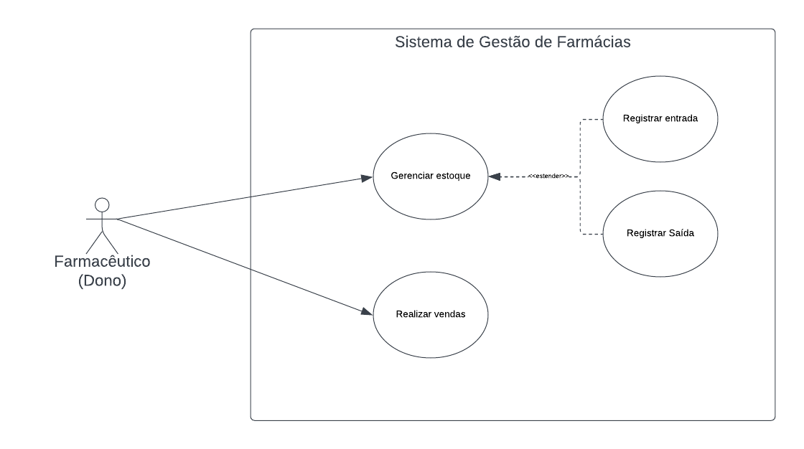

# Sistema de Estoque para Farmácias

Documento de visão do negócio <a href="1-Documentação de Contexto.md"> Documentação de Contexto</a>

Elaboração:
•	Alessandra Gabriele Vataro da Silva Murat
•	Camila Patrícia Ferreira dos Santos
•	Celso Nunes Soares
•	Gabriel Marco Ferreira Assis
•	Gean Carlos Campos Bráz
•	Laura Alice Santos Leite
•	Wesley de Camargo Murat

Orientador:
•	Will Ricardo dos Santos Machado

## Sumário

1.	Introdução .................................................................................................................................................	4
2. 	Objetivo ....................................................................................................................................................	5
3. 	Justificativa ..............................................................................................................................................	6
4.	Criação de um Sistema de Estoque para Farmácias ............................................................................................................ 7 
5.	Personas ...................................................................................................................................................	8
6.	Histórias de Usuários ...................................................................................................................................... 9
7.	Requisitos ................................................................................................................................................	10
8. 	Avaliações ................................................................................................................................................	11
9.	Identificar os perfis de usuários, investigar suas necessidades e elaborar personas .......................................................................	12
10. 	Conclusão ...............................................................................................................................................	16

## Personas

Pedro Paulo tem 26 anos, é arquiteto recém-formado e autônomo. Pensa em se desenvolver profissionalmente através de um mestrado fora do país, pois adora viajar, é solteiro e sempre quis fazer um intercâmbio. Está buscando uma agência que o ajude a encontrar universidades na Europa que aceitem alunos estrangeiros.

Enumere e detalhe as personas da sua solução. Para tanto, baseie-se tanto nos documentos disponibilizados na disciplina e/ou nos seguintes links:

> **Links Úteis**:
>
> - [Rock Content](https://rockcontent.com/blog/personas/)
> - [Hotmart](https://blog.hotmart.com/pt-br/como-criar-persona-negocio/)
> - [O que é persona?](https://resultadosdigitais.com.br/blog/persona-o-que-e/)
> - [Persona x Público-alvo](https://flammo.com.br/blog/persona-e-publico-alvo-qual-a-diferenca/)
> - [Mapa de Empatia](https://resultadosdigitais.com.br/blog/mapa-da-empatia/)
> - [Mapa de Stalkeholders](https://www.racecomunicacao.com.br/blog/como-fazer-o-mapeamento-de-stakeholders/)
>
> Lembre-se que você deve ser enumerar e descrever precisamente e personalizada todos os clientes ideais que sua solução almeja.

## Histórias de Usuários

Com base na análise das personas forma identificadas as seguintes histórias de usuários:

| EU COMO... `PERSONA` | QUERO/PRECISO ... `FUNCIONALIDADE` | PARA ... `MOTIVO/VALOR`                |
| -------------------- | ---------------------------------- | -------------------------------------- |
| Usuário do sistema   | Registrar minhas tarefas           | Não esquecer de fazê-las               |
| Administrador        | Alterar permissões                 | Permitir que possam administrar contas |

Apresente aqui as histórias de usuário que são relevantes para o projeto de sua solução. As Histórias de Usuário consistem em uma ferramenta poderosa para a compreensão e elicitação dos requisitos funcionais e não funcionais da sua aplicação. Se possível, agrupe as histórias de usuário por contexto, para facilitar consultas recorrentes à essa parte do documento.

> **Links Úteis**:
>
> - [Histórias de usuários com exemplos e template](https://www.atlassian.com/br/agile/project-management/user-stories)
> - [Como escrever boas histórias de usuário (User Stories)](https://medium.com/vertice/como-escrever-boas-users-stories-hist%C3%B3rias-de-usu%C3%A1rios-b29c75043fac)
> - [User Stories: requisitos que humanos entendem](https://www.luiztools.com.br/post/user-stories-descricao-de-requisitos-que-humanos-entendem/)
> - [Histórias de Usuários: mais exemplos](https://www.reqview.com/doc/user-stories-example.html)
> - [9 Common User Story Mistakes](https://airfocus.com/blog/user-story-mistakes/)

## Requisitos

As tabelas que se seguem apresentam os requisitos funcionais e não funcionais que detalham o escopo do projeto. Para determinar a prioridade de requisitos, aplicar uma técnica de priorização de requisitos e detalhar como a técnica foi aplicada.

### Requisitos Funcionais

| ID     | Descrição do Requisito                                 | Historia do Usuário                                                                                                                                                      | Prioridade |
| ------ | ------------------------------------------------------ | ------------------------------------------------------------------------------------------------------------------------------------------------------------------------ | ---------- |
| RF-001 | Listar Produtos, Fornecedores, Clientes e Funcionários | Como usuário, quero visualizar uma lista completa de produtos, fornecedores, clientes e funcionários para facilitar a consulta.                                          | ALTA       |
| RF-002 | Adicionar Produto, Fornecedor, Cliente ou Funcionário  | Como usuário, desejo poder adicionar novos produtos, fornecedores, clientes ou funcionários ao sistema para manter as informações atualizadas.                           | ALTA       |
| RF-003 | Editar Produto, Fornecedor, Cliente ou Funcionário     | Como usuário, desejo editar as informações de produtos, fornecedores, clientes ou funcionários para corrigir dados ou realizar atualizações.                             | ALTA       |
| RF-004 | Verificar e Atualizar Estoque                          | Como usuário, quero verificar o estoque atual e ter a capacidade de atualizar as quantidades disponíveis para garantir precisão nas informações.                         | ALTA       |
| RF-005 | Registrar Nova Venda                                   | Como usuário, desejo registrar novas vendas no sistema, incluindo detalhes como produtos vendidos, quantidades e datas, para manter um histórico preciso.                | ALTA       |
| RF-006 | Relatório de Vendas e Estoque                          | Como usuário, desejo gerar relatórios detalhados de vendas e estoque para análise e tomada de decisões informadas.                                                       | MÉDIA      |
| RF-007 | Relatório de Clientes e Funcionários                   | Como usuário, desejo obter relatórios que forneçam informações sobre clientes e funcionários para facilitar a gestão e avaliação do desempenho.                          | MÉDIA      |
| RF-008 | Alterar Senha e Configurações de perfil                | Como usuário, desejo ter a capacidade de alterar minha senha e ajustar configurações de perfil conforme necessário para garantir a segurança e personalização do acesso. | BAIXA      |

### Requisitos não Funcionais

| ID      | Descrição do Requisito                                                                                                             | Prioridade |
| ------- | ---------------------------------------------------------------------------------------------------------------------------------- | ---------- |
| RNF-001 | A interface do usuário deve ser intuitiva e fácil de usar para garantir eficiência no gerenciamento.                               | ALTA       |
| RNF-002 | O acesso às informações do sistema deve ser protegido por autenticação, e a senha deve ser armazenada de forma segura.             | ALTA       |
| RNF-003 | O sistema deve ser capaz de lidar com um aumento futuro no número de produtos, clientes e transações sem comprometer o desempenho. | MÉDIA      |
| RNF-004 | Atualizações e manutenções do sistema devem ser realizadas de forma fácil e sem interromper as operações principais.               | BAIXA      |
| RNF-005 | O sistema deve ser capaz de processar operações de gerenciamento rapidamente, mesmo com grandes conjuntos de dados.                | BAIXA      |

Com base nas Histórias de Usuário, enumere os requisitos da sua solução. Classifique esses requisitos em dois grupos:

- [Requisitos Funcionais
  (RF)](https://pt.wikipedia.org/wiki/Requisito_funcional):
  correspondem a uma funcionalidade que deve estar presente na
  plataforma (ex: cadastro de usuário).
- [Requisitos Não Funcionais
  (RNF)](https://pt.wikipedia.org/wiki/Requisito_n%C3%A3o_funcional):
  correspondem a uma característica técnica, seja de usabilidade,
  desempenho, confiabilidade, segurança ou outro (ex: suporte a
  dispositivos iOS e Android).
  Lembre-se que cada requisito deve corresponder à uma e somente uma
  característica alvo da sua solução. Além disso, certifique-se de que
  todos os aspectos capturados nas Histórias de Usuário foram cobertos.

## Restrições

O projeto está restrito pelos itens apresentados na tabela a seguir.

| ID  | Restrição                                             |
| --- | ----------------------------------------------------- |
| 01  | O projeto deverá ser entregue até o final do semestre |
| 02  | Não pode ser desenvolvido um módulo de backend        |

Enumere as restrições à sua solução. Lembre-se de que as restrições geralmente limitam a solução candidata.

> **Links Úteis**:
>
> - [O que são Requisitos Funcionais e Requisitos Não Funcionais?](https://codificar.com.br/requisitos-funcionais-nao-funcionais/)
> - [O que são requisitos funcionais e requisitos não funcionais?](https://analisederequisitos.com.br/requisitos-funcionais-e-requisitos-nao-funcionais-o-que-sao/)

## Diagrama de Casos de Uso

