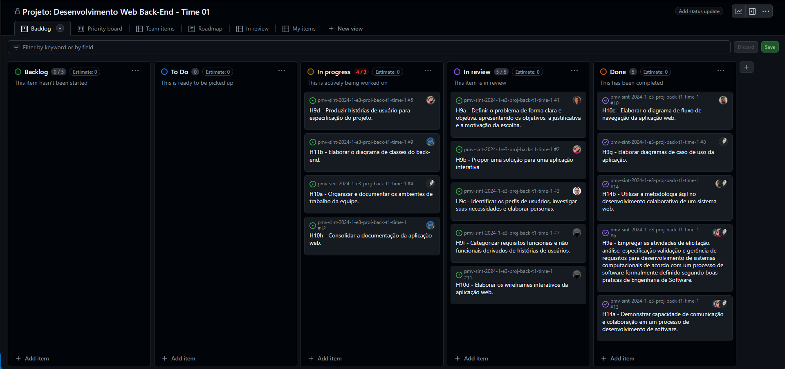

# Metodologia

Pré-requisitos: <a href="1-Documentação de Contexto.md"> Documentação de Contexto</a>

Para a organização e gestão das tarefas no desenvolvimento do projeto, foi implementado um quadro Kanban através do Github, permitindo uma visão clara do andamento do projeto e facilitando a colaboração entre os membros da equipe.

Para as reuniões de equipe optamos pelo Microsoft Teams, que é o padrão utilizado pela nossa instituição de ensino, garantindo uma comunicação fluida e eficaz.

## Relação de Ambientes de Trabalho

Para o desenvolvimento dos diagramas e das interfaces, utilizamos uma variedadede de ferramentas a qual cada membro tinha familiariedade e foram cruciais para a conclusão de cada item do quadro de atividades. Abaixo temos a tabela com as ferramentas utilizadas para cada item:

| Atividade                           | Ferramenta                        | Acesso                                                                                                                                                                                                                                                 |
| ----------------------------------- | --------------------------------- | ------------------------------------------------------------------------------------------------------------------------------------------------------------------------------------------------------------------------------------------------------ |
| Gerenciamento de Tarefas            | Quadro Kanban integrado ao Github | https://github.com/orgs/ICEI-PUC-Minas-PMV-SInt/projects/22                                                                                                                                                                                            |
| Edição de código          | Visual Studio | |
| Comunicação da Equipe               | Microsoft Teams                   | https://teams.microsoft.com/l/meetup-join/19%3aXIzd_gG06yBtnGA3gplHkPJtPTsEyST6_k-eHiYlEpA1%40thread.tacv2/1678832324616?context=%7b%22Tid%22%3a%2214cbd5a7-ec94-46ba-b314-cc0fc972a161%22%2c%22Oid%22%3a%225fc47345-261d-4339-8223-030a4de9654b%22%7d |
| Repositório de código fonte         | Git/Github                        | https://github.com/ICEI-PUC-Minas-PMV-SInt/pmv-sint-2024-1-e3-proj-back-t1-time-1                                                                                                                                                                      |
| Interface da aplicação (Wireframes) | Figma                             | https://www.figma.com/file/gvKmO7C4IdLUisRMG8fd3N/Untitled?type=design&node-id=0%3A1&mode=design&t=vbHZWZU4OEUYRbKI-1                                                                                                                                  |
| Diagrama de fluxo de navegação      |                                   |                                                                                                                                                                                                                                                        |
| Diagrama de classes                 | Visual Studio - Class Design      |                                                                                                                                                                                                                                                        |
| Diagrama de caso de uso             |                                   |https://lucid.app/lucidchart/4c579cf8-7875-49df-a01d-9927da18e836/edit?viewport_loc=-1233%2C-1689%2C4385%2C2189%2C0_0&invitationId=inv_846fcdbc-0632-44d4-9d7d-f322c724128a                                                                            |

## Controle de Versão

A ferramenta de controle de versão adotada no projeto foi o
[Git](https://git-scm.com/), sendo que o [Github](https://github.com)
foi utilizado para hospedagem do repositório.

O projeto segue a seguinte convenção para o nome de branches:

- `main`: versão estável já testada do software
- `unstable`: versão já testada do software, porém instável
- `testing`: versão em testes do software
- `dev`: versão de desenvolvimento do software

Quanto à gerência de issues, o projeto adota a seguinte convenção para
etiquetas:

- `documentation`: melhorias ou acréscimos à documentação
- `bug`: uma funcionalidade encontra-se com problemas
- `enhancement`: uma funcionalidade precisa ser melhorada
- `feature`: uma nova funcionalidade precisa ser introduzida

## Gerenciamento de Projeto

### Divisão de Papéis

A equipe utiliza metodologias ágeis, tendo escolhido o Scrum como base para definição do processo de desenvolvimento. A equipe está organizada da seguinte maneira:

- Scrum Master: Gean Carlos Campos Bráz;
- Product Owner: Gabriel Marco Ferreira Assis;
- Equipe de Desenvolvimento: Camila Patrícia Ferreira dos Santos, Celso Nunes Soares e Laura Alice Santos Leite;
- Equipe de Design: Alessandra Gabriele Vataro da Silva Murat e Wesley de Camargo Murat.

### Processo

Com base nas orientações em aula, criamos uma sprint para cada etapa do projeto, associando issues que são as habilidades a serem avaliadas. A cada final de sprint, as issues são fechadas para a conclusão da sprint na data agendada.

Ao longo de cada sprint foram determinadas 2 reuniões síncronas, sendo uma com o orientador do projeto (Will Ricardo dos Santos Machado) e outra com a equipe para mapear o que cada membro está desenvolvendo e compartilhar possíveis impedimentos para discussão/solução. E contatos assincronos para manter o projeto dentro do cronograma preestabelecido.

