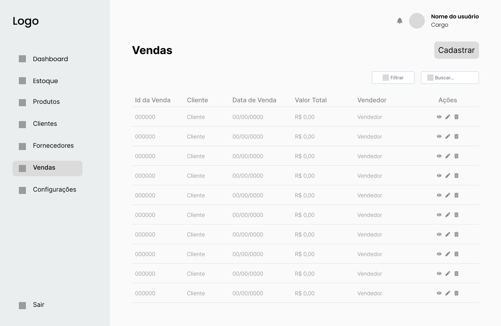

# Projeto de Interface

Pré-requisitos: <a href="2-Especificação do Projeto.md"> Documentação de Especificação</a>

Visão geral da interação do usuário pelas telas do sistema e protótipo interativo das telas com as funcionalidades que fazem parte do sistema (wireframes).

## Diagrama de Fluxo

O diagrama apresenta o estudo do fluxo de interação do usuário com o sistema interativo e  muitas vezes sem a necessidade do desenho do design das telas da interface. Isso permite que o design das interações seja bem planejado e gere impacto na qualidade no design do wireframe interativo que será desenvolvido logo em seguida.

O diagrama de fluxo pode ser desenvolvido com “boxes” que possuem internamente a indicação dos principais elementos de interface - tais como menus e acessos - e funcionalidades, tais como editar, pesquisar, filtrar, configurar - e a conexão entre esses boxes a partir do processo de interação. Você pode ver mais explicações e exemplos https://www.lucidchart.com/blog/how-to-make-a-user-flow-diagram.

# Wireframes Desenvolvidos no Figma

## Tela - Login

A tela inicial, ou homepage, é a página de boas-vindas da aplicação, onde é possível encontrar um formulário de login, com um botão localizado no meio da pagina destinado ao login.

Esta tela é composta por quatro componentes principais:

- O componente do formulário de login permite ao usuário acessar a aplicação;
- O componente de link para "Esqueceu a senha", facilitando a recuperação de acesso;
- O componente de link para "Falar com o Consultor", oferecendo a possibilidade de contratar a ferramenta;
- O componente de link "Teste Grátis", que permite testar a ferramenta gratuitamente por 7 dias."

---
## Tela - Recuperar Senha

A tela de Recuperar Senha é um componente essencial do sistema de autenticação, projetada para auxiliar os usuários que esqueceram suas senhas. Ela oferece uma maneira segura e eficiente de redefinir a senha, garantindo que os usuários possam acessar suas contas sem interrupções.

Esta tela é composta por dois componentes principais:

- **Formulário de Recuperação**: Permite ao usuário inserir seu endereço de e-mail ou nome de usuário associado à conta. Este formulário é crucial para identificar a conta correta.
- **Componente de Retorno**: Após o processo de redefinição de senha ser concluído, oferece a opção de voltar para a tela de login, facilitando a reintegração ao fluxo normal de autenticação.

---
## Tela - Teste Gratuito

A tela de Teste Gratuito é um recurso inovador projetado para atrair novos usuários e oferecer uma experiência prática da plataforma antes de se comprometer com uma assinatura paga. Ela permite que os usuários acessem recursos premium ou funcionalidades avançadas por um período limitado, geralmente 7 dias, sem custo.

Esta tela é composta por três componentes principais:

- **Formulário de Inscrição**: Permite ao usuário inserir suas informações pessoais e de contato para configurar o teste gratuito. Este formulário é crucial para personalizar a experiência do usuário.
- **Descrição do Teste Gratuito**: Fornece detalhes sobre o que é incluído no teste gratuito, como acesso a recursos premium, limitações temporárias, e como proceder após o término do teste.
- **Botão de Registrar**: Após o preenchimento do formulário, o usuário pode clicar em um botão para iniciar o processo de inscrição no teste gratuito.

---
## Tela – Dashboard

O Dashboard é a tela que apresenta as funcionalidades disponíveis para o usuário, incluindo Dashboard, Estoque, Produtos, Clientes, Fornecedores, Vendas e Configurações.

Esta tela é composta por seis componentes principais:

- **Componente de Informação de Cadastro**: Exibe o nome do usuário logado, facilitando a identificação do usuário na sessão.
- **Componente de Botão de Sair**: Permite encerrar a sessão do usuário e retornar à página de login, garantindo a segurança e a privacidade.
- **Componente de Itens com Baixo Estoque**: Informa os nomes dos fornecedores de produtos que estão com estoque baixo, auxiliando na gestão de estoque.
- **Componente de Últimas Vendas**: Fornece informações relevantes para a gestão de vendas, incluindo detalhes sobre as transações recentes.
- **Componentes de Produtos Mais Vendidos**: Lista os produtos mais vendidos, destacando atributos como nome, categoria e volume de vendas, facilitando a análise de tendências de mercado.
- **Componente de Menu**: Localizado no lado direito da tela, oferece opções para navegar pelas funcionalidades da aplicação, proporcionando uma experiência de usuário intuitiva e eficiente.
  

---
## Tela – Estoque

A tela de Estoque é uma ferramenta crucial para gerenciar e monitorar os produtos disponíveis no inventário. Ela fornece uma visão detalhada dos itens em estoque, incluindo informações como Código do Produto, Nome do Produto, Preço Unitário, Lote, Validade, Fornecedor e Quantidade.

Esta tela é composta por quatro componentes principais:

- **Componente de Nova Entrada**: Permite o cadastro de novos produtos no estoque, facilitando a inclusão de novos itens.
- **Componente de Filtro**: Oferece a possibilidade de realizar filtros personalizáveis, permitindo ao usuário realizar consultas mais precisas e específicas.
- **Componente de Busca**: Facilita a localização de produtos específicos, tornando mais fácil encontrar itens no estoque.
- **Componente de Ações**: Inclui opções para editar e remover produtos do estoque, garantindo a atualização e a manutenção do Estoque.
  

---
## Tela – Cadastrar Entrada

A tela de Cadastrar Entrada é um componente essencial para adicionar e atualizar o estoque de produtos que foram previamente cadastrados na tela de Cadastrar Produtos. Isso permite ao usuário gerenciar os estoques de maneira mais eficiente, mantendo o inventário atualizado e facilitando a gestão de produtos.

Esta tela é composta por dois componentes principais:

- **Formulário de Cadastro**: Permite ao usuário inserir detalhes sobre o produto, incluindo informações como Nome do Produto, Fornecedor, Quantidade, Data de Entrada, Nota Fiscal, Data de Validade, Preço Unitário, e Localização no Estoque. Este formulário é crucial para registrar corretamente a nova entrada no sistema.
- **Botão Salvar**: Permite ao usuário salvar os dados inseridos no formulário como um novo produto de estoque no inventário, facilitando a atualização e a gestão do inventário.
  

---
## Tela – Produtos

A tela de Produtos é um espaço dedicado à gestão e organização dos itens disponíveis. Ela atua como um hub central para o gerenciamento de todos os produtos, fornecendo uma visão abrangente e detalhada de cada item, incluindo informações essenciais como Código, Nome, Preço Unitário, Lote, Validade e Categorias.

Esta tela é composta por quatro componentes principais:

- **Componente de Cadastro**: Permite o registro de um novo produto na base de dados, facilitando a inclusão de novos itens no inventário.
- **Componente de Filtro**: Oferece a possibilidade de realizar filtros personalizáveis, permitindo ao usuário realizar consultas mais precisas e específicas.
- **Componente de Busca**: Facilita a localização de produtos específicos, tornando mais fácil encontrar itens no inventário.
- **Componente de Ações**: Inclui opções para editar e remover produtos do estoque, garantindo a atualização e a manutenção do inventário.
  

---
## Tela – Cadastrar Produto

A tela de Cadastrar Produto é um componente essencial na funcionalidade de estoque, permitindo que os usuários registrem novas entradas de produtos no inventário. Ela é projetada para facilitar a inclusão de novos itens, seja por aquisição, transferência interna, ou de fornecedores externos, atualizando automaticamente o estoque disponível.

Esta tela é composta por dois componentes principais:

- **Formulário de Entrada**: Permite ao usuário inserir detalhes sobre o novo produto, incluindo informações como Nome do Produto, Descrição do Produto, Categoria, Data de Validade, Preço Unitário, Fornecedor, e a opção de adicionar uma Imagem do Produto. Este formulário é crucial para registrar corretamente o novo produto no sistema.
- **Campo para Upload de Imagem**: Oferece a possibilidade de adicionar uma imagem representativa do produto, melhorando a visualização e a identificação do item no inventário.
- **Botão Salvar**: Permite ao usuário salvar os dados inseridos no formulário como um novo produto de estoque no inventário, facilitando a atualização e a gestão do inventário.
  

---
## Tela – Clientes

A tela de Clientes é um espaço dedicado à gestão e monitoramento dos clientes da plataforma. Ela atua como um hub central para o gerenciamento de todos os dados dos clientes, fornecendo uma visão abrangente e detalhada de cada cliente, incluindo informações essenciais como nome, e-mail, telefone, data de cadastro e situação.

Esta tela é composta por quatro componentes principais:

- **Componente de Cadastro**: Permite o registro de um novo cliente, facilitando a inclusão de novos perfis no sistema.
- **Componente de Filtro**: Oferece a possibilidade de realizar filtros personalizáveis, permitindo ao usuário realizar consultas mais precisas e específicas para encontrar um cliente em específico.
- **Componente de Busca**: Facilita a localização de clientes, tornando mais fácil encontrar um cliente específico.
- **Componente de Ações**: Inclui opções para editar e remover clientes na base de dados, garantindo a atualização e a manutenção das informações dos clientes.
  

---
## Tela – Cadastrar Clientes

A tela de Cadastrar Clientes é um componente fundamental para a gestão de clientes, permitindo que os usuários adicionem novos clientes ao sistema de forma eficiente. Ela é projetada para facilitar o registro de novos clientes, incluindo informações essenciais como Nome, Telefone, Email, Data de Nascimento, CPF e Genero, Enderçeo.

Esta tela é composta por dois componentes principais:

- **Formulário de Cadastro**: Permite ao usuário inserir detalhes sobre o novo cliente, incluindo informações como Nome, E-mail, Telefone e  Endereço. Este formulário é crucial para registrar corretamente o novo cliente no sistema.
- **Botão Salvar**: Permite ao usuário salvar os dados inseridos no formulário como um novo produto de estoque no inventário, facilitando a atualização e a gestão do inventário.
  

---
## Tela – Fornecedores

A tela de Fornecedores é um espaço dedicado à gestão e monitoramento dos fornecedores da plataforma. Ela serve como um hub central para o gerenciamento de todos os dados dos fornecedores, oferecendo uma visão abrangente e detalhada de cada fornecedor, incluindo informações essenciais como CNPJ, Nome da Empresa, E-mail e Telefone.

Esta tela é composta por quatro componentes principais:

- **Lista de Fornecedores**: Exibe todos os fornecedores registrados, permitindo uma rápida visualização e comparação dos perfis dos fornecedores.
- **Filtros de Pesquisa**: Facilitam a busca por fornecedores específicos, seja por nome, localização, ou produtos fornecidos.
- **Componente de Busca**: Facilita a localização de fornecedores, tornando mais fácil encontrar um fornecedor específico.
- **Componente de Ações**: Inclui opções para editar e remover fornecedores na base de dados, garantindo a atualização e a manutenção das informações dos fornecedores.
  

---
## Tela – Cadastrar Fornecedores

A tela de Cadastrar Fornecedores é um componente essencial para a gestão de fornecedores, permitindo que os usuários adicionem novos fornecedores ao sistema de forma eficiente. Ela é projetada para facilitar o registro de novos fornecedores, incluindo informações essenciais como Nome da Empresa, CNPJ , Email, Telefone e Endereço.

Esta tela é composta por dois componentes principais:

- **Formulário de Cadastro**: Permite ao usuário inserir detalhes sobre o novo fornecedor, incluindo informações como Nome da Empresa, CNPJ, Email, Telefone e Endereço. Este formulário é crucial para registrar corretamente o novo fornecedor no sistema.
- **Botão Salvar**: Permite ao usuário salvar os dados inseridos no formulário como um novo fornecedor.
  

---
## Tela – Vendas

A tela de Vendas é um componente central para o gerenciamento de transações de vendas na plataforma. Ela serve como um hub para o registro, análise, e gestão de todas as vendas realizadas, oferecendo uma visão abrangente e detalhada de cada transação, incluindo informações essenciais como ID da Venda, Cliente, Data de Venda, Valor Total e Vendedor.

Esta tela é composta por dois componentes principais:

- **Botão para Cadastrar Novas Vendas**: Permite ao usuário iniciar o processo de registro de uma nova venda, facilitando a inclusão de novas transações no sistema.
- **Componente de Ações**: Inclui opções para editar e remover vendas na base de dados, garantindo a atualização e a manutenção das informações de vendas. Além disso, oferece a função de visualizar os detalhes da venda, incluindo informações sobre os produtos vendidos, quantidade, fornecedor, entre outros detalhes relevantes.
  

---
## Tela – Cadastrar Vendas

A tela de Cadastrar Vendas é um componente essencial para o registro e gerenciamento de transações de vendas na plataforma. Ela é projetada para facilitar o processo de inclusão de novas vendas, permitindo que os usuários adicionem detalhes sobre cada transação, incluindo informações como Data e Hora de Venda, Nome do Cliente, E-mail, Telefone, Vendedor, Forma de Pagamento, Endereço, e informações do produto.

Esta tela é composta por dois componentes principais:

- **Formulário de Cadastro**: Permite ao usuário inserir detalhes sobre a nova venda, incluindo informações como Data e Hora de Venda, Nome do Cliente, E-mail, Telefone, Vendedor, Forma de Pagamento, Endereço, e informações do produto. Este formulário é crucial para registrar corretamente a nova venda no sistema.
- **Botão Salvar**: Permite ao usuário salvar os dados inseridos no formulário como uma nova venda, facilitando a atualização e a gestão do banco de dados de vendas.
  

---

