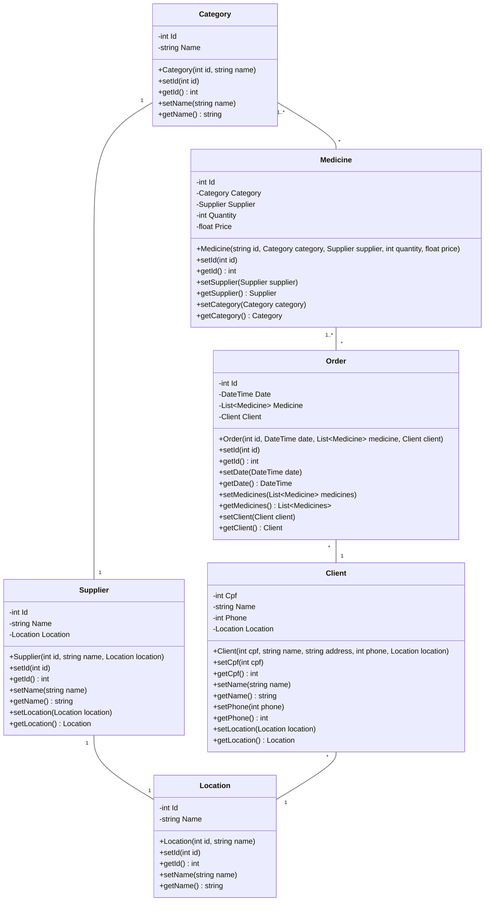

# Arquitetura da Solução

Pré-requisitos: <a href="3-Projeto de Interface.md"> Projeto de Interface</a>

Definição de como o software é estruturado em termos dos componentes que fazem parte da solução.

## Diagrama de Classes

Acima está um protótipo do diagrama de classes e seu esquema relacional. Note que todo o esquema é passível de alterações a medida que o projeto for desenvolvido!

- `Category`: Categoria do produto
- `Supplier`: Fornecedor do produto
- `Medicine`: O produto em si (medicamento, entre outros)
- `Order`: O pedido de um produto
- `Client`: Cliente registrado com nome e endereço
- `Location`: Usado em `Client` e `Supplier`, para identificação em comum de localizações
