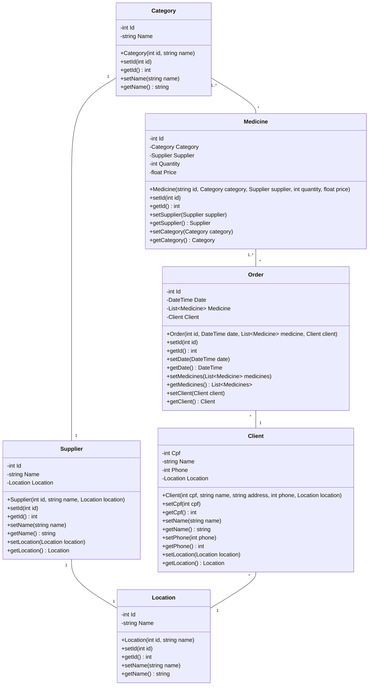
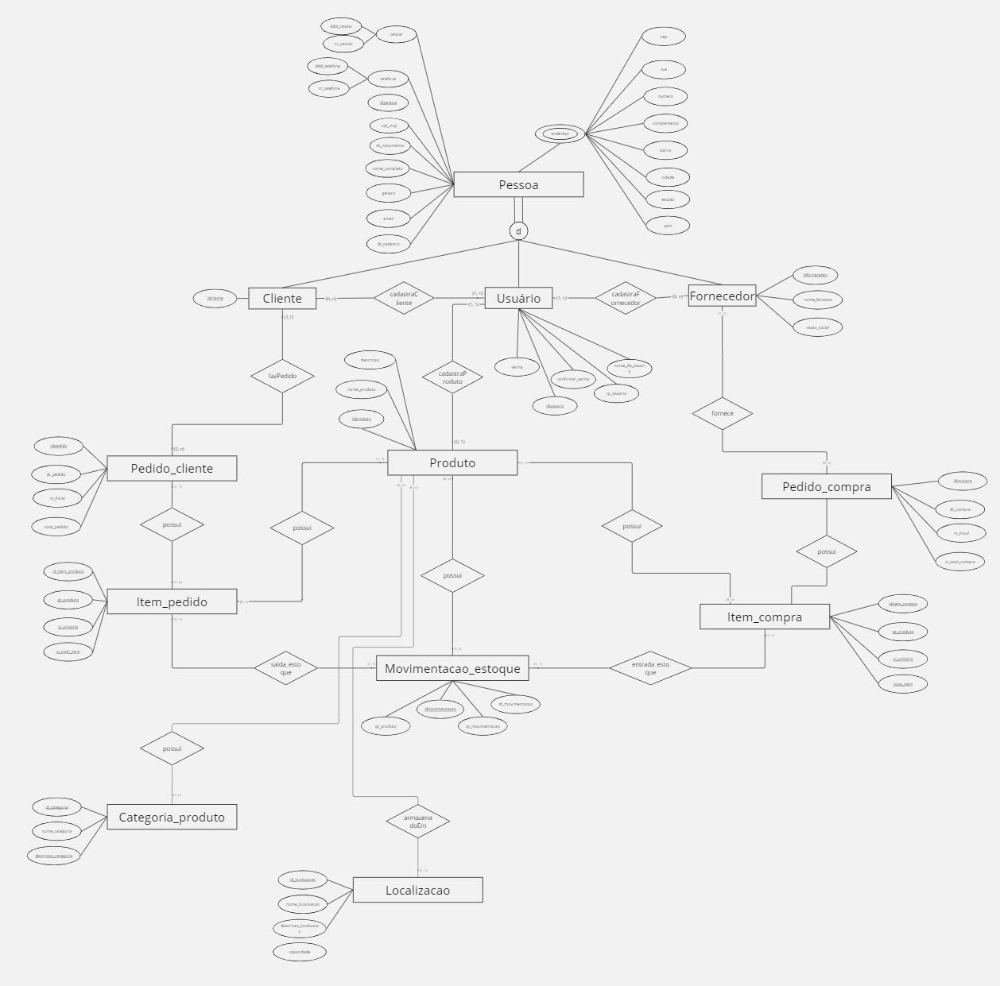

# Arquitetura da Solução

Pré-requisitos: <a href="04-Projeto de Interface.md"> Projeto de Interface</a>

## Diagrama de Classes

Acima está um protótipo do diagrama de classes e seu esquema relacional. Note que todo o esquema é passível de alterações a medida que o projeto for desenvolvido!

- `Category`: Categoria do produto
- `Supplier`: Fornecedor do produto
- `Medicine`: O produto em si (medicamento, entre outros)
- `Order`: O pedido de um produto
- `Client`: Cliente registrado com nome e endereço
- `Location`: Usado em `Client` e `Supplier`, para identificação em comum de localizações

---

### Identificação de Entidades

#### Pessoa

A tabela Pessoa é responsável por armazenar os dados pessoais e de contato de usuários, fornecedores e clientes do sistema. Cada registro nesta tabela representa uma entidade única que pode estar associada a diferentes papéis no sistema, como usuário, fornecedor ou cliente.

- 🔑 id_pessoa: int
- cpf_cnpj: varchar(14)
- dt_nascimento: date
- nome_completo: varchar(255)
- genero: char(1)
- email: varchar(255)
- dt_cadastro: date
- ddd_telefone: varchar(3)
- nr_telefone: varchar(8)
- ddd_celular: varchar(3)
- nr_celular: varchar(9)

#### Endereço
- 🔑 id_endereço: int
- cep: varchar(8)
- logradouro: varchar(255)
- numero: varchar(10)
- complemento: varchar(100)
- bairro: varchar(255)
- cidade: varchar(100)
- estado: varchar(100)
- pais: varchar(100)
- 🔐 id_pessoa: int

#### Usuário

A tabela Usuário armazena as informações de login e tipo de usuários do sistema, estabelecendo um relacionamento com a tabela Pessoa para associar cada usuário a uma pessoa específica. A chave estrangeira id_pessoa é usada para garantir que cada registro na tabela Usuário esteja associado a um registro válido na tabela Pessoa.

- 🔑 id_usuario: int
- senha_hash: varchar(255)
- confirmar_senha_hash: varchar(255)
- tp_usuario: varchar(20)
- nome_de_usuario: varchar(50)
- 🔐 id_pessoa: int

#### Cliente
- 🔑 id_cliente: int
- 🔐 id_pessoa: int
- 🔐 id_usuario: int

#### Fornecedor
- 🔑 id_fornecedor: int
- nome_fantasia: varchar(255)
- razao_social: varchar(255)
- 🔐 id_pessoa: int
- 🔐 id_usuario: int

#### Categoria
- 🔑 id_categoria: int
- nome_categoria: varchar(100)
- descricao_categoria: varchar(1000)

#### Localização
- 🔑 id_localizacao: int
- nome_localizacao: varchar(100)
- descricao_localizacao: varchar(1000)
- capacidade: int

#### Produto
- 🔑 id_produto: int
- nome_produto: varchar(100)
- descricao: varchar(1000)
- dt_cadastro: datetime
- 🔐 id_usuario: int
- 🔐 id_categoria: int
- 🔐 id_localizacao: int

#### Produto
- 🔑 id_produto: int
- nome_produto: varchar(100)
- descricao: varchar(1000)
- dt_cadastro: datetime
- 🔐 id_usuario: int
- 🔐 id_categoria: int
- 🔐 id_localizacao: int

#### Pedido_Cliente
- 🔑 id_pedido: int
- dt_pedido: datetime
- nt_fiscal: vatchar(20)
- vl_total: decimal(10, 2)
- 🔐 id_cliente: int

#### Item_Pedido
- 🔑 id_item_pedido: int
- qt_produto: int
- vl_total_item: decimal(10, 2)
- vl_unitario_item: decimal(10, 2)
- 🔐 id_produto: int
- 🔐 id_pedido: int

#### Pedido_Compra
- 🔑 id_compra: int
- dt_compra: datetime
- nt_fiscal: vatchar(20)
- vl_total: decimal(10, 2)
- 🔐 id_fornecedor: int

#### Item_Compra
- 🔑 id_item_compra: int
- qt_produto: int
- vl_total_item: decimal(10, 2)
- vl_unitario_item: decimal(10, 2)
- 🔐 id_produto: int
- 🔐 id_compra: int

Obs:
- 🔑 Chave Primária: Campo em uma entidade que é utilizado para identificar de forma exclusiva cada registro;
- 🔐 Chave estrangeira: Campo que estabelece a relação entre tabelas, mantendo a integridade referencial entre os dados. 
  

## Modelo ER

  

## Modelo Relacional

  

Acesse o <a href="https://miro.com/app/board/uXjVKWYIxGU=/?share_link_id=402646098372">Miro</a> para uma visualização mais precisa e detalhada dos diagramas

## Modelo Físico (DDL)

O arquivo relacionado ao modelo físico se encontra em:

<a href="https://github.com/ICEI-PUC-Minas-PMV-SInt/pmv-sint-2024-1-e3-proj-back-t1-time-1/blob/main/src/bd/script_ddl.sql">DDL</a>

## Instruções SQL de Manipulação do BD (DML)

O arquivo relacionado ao as instruções SQL de Manipulação de BD se encontra em:

<a href="https://github.com/ICEI-PUC-Minas-PMV-SInt/pmv-sint-2024-1-e3-proj-back-t1-time-1/blob/main/src/bd/script.dml.sql">DML</a>
