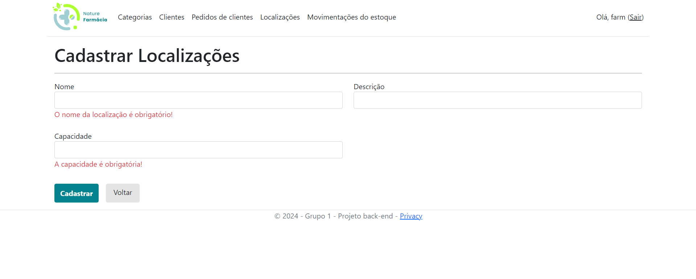

# Programação de Funcionalidades

<span style="color:red">Pré-requisitos: <a href="2-Especificação do Projeto.md"> Especificação do Projeto</a></span>, <a href="3-Projeto de Interface.md"> Projeto de Interface</a>, <a href="4-Metodologia.md"> Metodologia</a>, <a href="3-Projeto de Interface.md"> Projeto de Interface</a>, <a href="5-Arquitetura da Solução.md"> Arquitetura da Solução</a>

# Padrões da Aplicação

## Padrão MVC

Padrão de design de software arquitetural que organiza a aplicação da seguinte forma:

### Model

É o objeto da aplicação, onde definimos os campos de cada entidade, tipo e regras.
Ex: A classe de Categorias, Usuário e Produto

```
 [Table("Categorias")]
 public class Categoria
 {
   [Key]
   public int Id { get; set; }

   [Required(ErrorMessage ="Obrigatório informar o nome da categoria")]
   [Display(Name = "Nome da Categoria")]
   public string NomeCategoria { get; set; }

   [Required(ErrorMessage = "Obrigatório informar a descrição da categoria")]
   [Display(Name = "Descrição da Categoria")]
   public string DescricaoCategoria { get; set; }

   ...
  }
```

### View

Responsável pelo visual a qual o usuário interage
Ex: Páginas dinâmicas geradas com o Razor como a de listagem, criação, edição e remoção de itens.

```
 // Páginas de exemplos na pasta Views > Localizacao

 - Create.cshtml
 - Delete.cshtml
 - Details.cshtml
 - Edit.cshtml
 - Index.cshtml

```

### Controller

É o intermediário entre a model e a view gerenciando, garantindo que os dados sejam mostrados corretamente de acordo com a requisição do usuário.

```
 ...
 namespace Pharma.Controllers
 {
     public class CategoriasController : Controller
     {
        private readonly AppDbContext _context;
        public CategoriasController(AppDbContext context) {
            _context = context;
        }

        public async Task<IActionResult> Index()
        {
            IEnumerable<Categoria> dados;


            if (User.IsInRole("Admin"))
            {
                 dados = await _context.Categorias.Include(c => c.Usuario).ToListAsync();


            } else
            {
                var userId = User.FindFirstValue(ClaimTypes.NameIdentifier);
                dados = await _context.Categorias
                    .Include(c => c.Usuario)
                    .Where(c => c.UsuarioId == int.Parse(userId))
                    .ToListAsync();

            }

            return View(dados);
        }
...

```

## Funcionalidades

### Tela Principal

Tela principal com botão de acessar conta.


Responsáveis:

- Estruturação da Página e lógica: Gabriel Marco
- Estilização: Alessandra Gabriele

### Login


Mensagens de apoio ao usuário caso algum campo não esteja preeenchido


Caso o mesmo digite dados inválidos, será alertado por ua caixa de texto


Responsáveis:

- Estruturação da Página, autenticação de usuário e rendeização de menus conforme tipo de usuário (admin ou formacêutico): Gabriel Marco
- Estilização e lógica na view para mostrar mensagem de credenciais inválidas: Alessandra Gabriele

### Criar Conta


Responsáveis:

- Estruturação da Página, validações de campos e lógica para criação do primeiro usuário como admin e automaticamente os próximos como farmacêutico: Gabriel Marco
- Estilização: Alessandra Gabriele

### Usuários

A opção de usuários somente estará disponível para usuário do tipo admin

Lista de Usuários


Para o cadastro foi utilizado a mesma tela para criar conta, mas com a adição do campo do tipo de usuário e botão de voltar


Detalhes do usuário


Editar Usuário


Alerta de mensagem, caso o admin tente excluir o único admin do sistema


Exclusão


Responsáveis:

- Estruturação da Model: Gabriel Marco
- Lógica de Listar, Visualizar detalhes, Cadastrar, Excluir e Editar: Gabriel Marco
- Criação da View: Gabriel Marco
- Criação de lógica para alterar rota e texto do botão na tela de cadastro
- Estiização: Alessandra Gabriele

### Categorias

Lista de categorias


A criação de categoria no momento está com apenas um campo, pois com a integração ficou faltando o campo de descrição que em breve será adicionado


Detalhes


Edição


Exclusão


Listagem de categorias Admin, onde o mesmo tem a possibilidade de visualizar todas as categorias cadastradas e qual usuário cadastrou


Responsáveis:

- Lógica para listar todas categorias cadastradas para o admin e listar para o farmacêutico somente as categorias que ele cadastrou: Alessandra Gabriele e Wesley Murat
- Estruturação da Model: Alessandra Murat
- Lógica de Listar, Visualizar detalhes, Cadastrar, Excluir e Editar: Alessandra Murat
- Criação da View e Estilização: Alessandra Gabriele

### Clientes

Lista de clientes


Cadastro


Detalhes


Edição


Exclusão


Responsável:

- Estruturação da Model: Gean Campos
- Lógica de Listar, Visualizar Detalhes, Cadastrar, Excluir e Editar: Gean Campos
- Criação da View e Estilização: Gean Campos

### Fornecedores

Lista de fornecedores


Cadastro


Detalhes


Edição


Exclusão


Responsável:

- Estruturação da Model: Camila Santos
- Lógica de Listar, Visualizar Detalhes, Cadastrar, Excluir e Editar: Camila
- Criação da View e Estilização: Camila

### Vendas

#### Página funcionando totalmente, mas existe a dependência da criação de um cliente, o que não está totalmente implementado ainda.

Responsável:

- Estruturação da Model: Gean Campos
- Lógica de Listar, Visualizar Detalhes, Cadastrar, Excluir e Editar: Gean Campos
- Criação da View e Estilização: Gean Campos

### Compras

Responsável:

- Estruturação da Model: Camila Santos
- Lógica de Listar, Visualizar Detalhes, Cadastrar, Excluir e Editar: Camila Campos
- Criação da View e Estilização: Camila Campos

### Localizações


Cadastro com validação de campos


Detalhes


Edição


Exclusão


Responsáveis:

- Lógica para listar todas as localizações cadastradas para o admin e listar para o farmacêutico somente as localizações que ele cadastrou: Wesley Murat e Alessandra (No momento não está aplicado a essa tela por conta das alterações na integração)
- Estruturação da Model: Wesley Murat
- Lógica de Listar, Visualizar detalhes, Cadastrar, Excluir e Editar: Wesley Murat
- Criação da View: Wesley Murat
- Estilização: Alessandra Gabriele

### Produto


Cadastro de produto


Edição de produto


Detalhe do produto


Exclusão do Produto


- Acompanhamento para realização da tarefa: Gean Campos
- Estruturação da Model: Laura Alice
- Lógica de Listar, Visualizar detalhes, Cadastrar, Excluir e Editar: Laura Alice
- Criação da View: Laura Alice
- Estilização: Alessandra Murat

### Estoque


Responsável:

- Estruturação da Model: Gean Campos
- Lógica de Listar, Visualizar Detalhes, Excluir e Editar: Gean Campos
- Criação da View: Gean Campos

Obs: A lógica segue o modelo de outras telas, entretanto será realizado uma alteração para que o Estoque seja atualizado de acordo com um pedido ou uma compra.

### Tabela intermediária de itens de uma venda (ItemPedidoCliente)

Responsável:

- Estruturação da Model: Gean Campos

Obs: Foi criado a view e os controllers, entretanto será necessário a modificação para essa tabela só receber os itens de cada pedido.

### Tabela intermediária de itens de uma compra (ItemPedidoCompra)

Responsável:

- Estruturação da Model: Celso Nunes

Obs: Foi criado a view e os controllers, entretanto será necessário a modificação para essa tabela só receber os itens de cada pedido.
